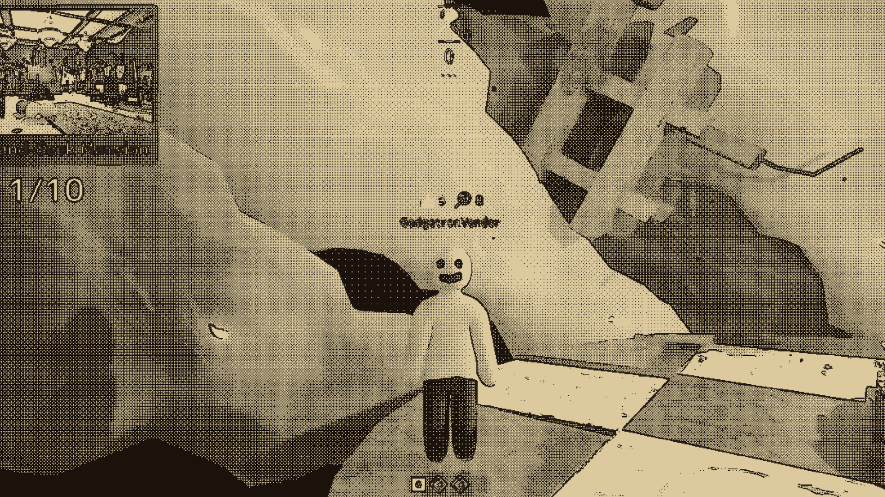

# Obra Chameleon

Obra Chameleon is an unofficial, fan-made ReShade effect for **Meccha Chameleon**. It converts the finished frame into a configurable two-color image with ordered dithering, virtual-resolution sampling, and optional edge enhancement inspired by the visual language of *Return of the Obra Dinn*.

No assets or shaders from either game are included.

## Gallery

| Title screen | Gameplay |
| --- | --- |
|  |  |

Both images are separate 1920x1080 shader-on captures. They are not a before-and-after comparison. See [assets/README.md](assets/README.md) for image licensing details.

## Install v0.2

> **WARNING: THIS MOD MAY GET YOU BANNED. USE AT YOUR OWN RISK. DO NOT USE IT ON PUBLIC SERVERS.** Anti-cheat and integrity behavior has not been confirmed.

Download **Obra Chameleon v0.2.zip** from the [latest release](../../releases/latest). Extract the `Obra Chameleon` directory directly inside the Meccha Chameleon installation root, next to `PenguinHotel.exe`.

Choose the guide for your operating system:

- [Ubuntu](scripts/package/ubuntu/README-Ubuntu.md)
- [Bazzite](scripts/package/bazzite/README-Bazzite.md)
- [Windows](scripts/package/windows/README-Windows.md)

On Windows, double-click `Obra Chameleon\windows\Install Obra Chameleon.cmd`. The launcher keeps the terminal open after success or failure so diagnostic messages can be read.

On Ubuntu and Bazzite, add this game-specific Steam launch option after installation:

```text
WINEDLLOVERRIDES="dxgi=n,b" %command%
```

The installers download ReShade 6.7.3 from the official ReShade site and verify pinned checksums. ReShade binaries are not bundled in this repository or release.

## Controls

- `Home`: open or close the ReShade overlay
- `Scroll Lock`: toggle the Obra Chameleon effect
- `Ctrl+R`: reload edited shaders
- `Page Up` / `Page Down`: cycle presets when configured in ReShade

The default preset uses a warm two-color palette and a 1280x720 virtual resolution. Parameters can be changed live through the ReShade overlay.

## Compatibility

The current prototype was developed on Ubuntu with the game's Direct3D 12 renderer translated by VKD3D-Proton. The Ubuntu installer has been exercised locally. The Bazzite installer has completed fixture and dry-run validation, and Windows has automated PowerShell validation; native Bazzite and Windows play testing is still required.

Depth access is not required for the default effect. UI is processed with the scene, so dense menus may be easier to read after toggling the effect off or increasing the virtual resolution. See [docs/compatibility.md](docs/compatibility.md) for the current test matrix.

Do not test ReShade in public multiplayer unless the game's anti-cheat and integrity behavior has been independently confirmed. Prefer the main menu, tutorial, solo play, or a private session.

## Development

This source tree intentionally lives inside a Steam game installation. The root `.gitignore` is a deny-all allowlist so proprietary game files and local runtime data are not tracked.

Before committing:

```bash
scripts/audit-repository.sh --staged
git diff --cached --check
```

Build the release archive:

```bash
scripts/build-release.sh --force
sha256sum "Obra Chameleon v0.2.zip" > "Obra Chameleon v0.2.zip.sha256"
```

**Never run `git clean -fd` or `git clean -fdx` in this repository.** Because the repository is inside the game installation, those commands can delete ignored game files.

## License

Original shader code, presets, scripts, and documentation are licensed under [GPL-3.0-only](LICENSE). Copyright 2026 Isaac Hathaway.

The gallery screenshots are demonstration material and are not licensed under the GPL. Meccha Chameleon, Return of the Obra Dinn, ReShade, Steam, Proton, and their associated names and assets belong to their respective owners. This project is not affiliated with or endorsed by those projects or companies.
